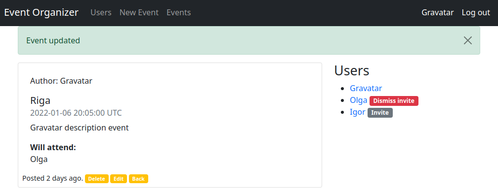
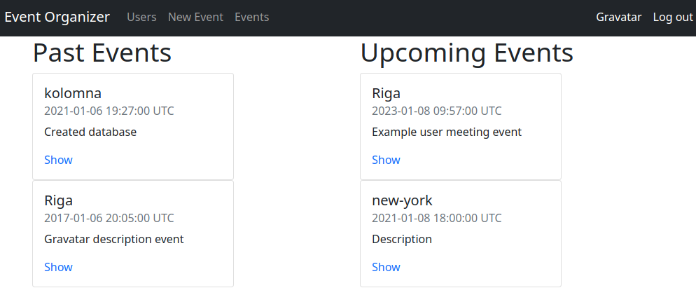

# Private events

## Summary

### Objectives

- Construct a bi-directional has many through.
- Query for associations via the belongs_to, has_many, and has_many through
  associations.
- Iterate over associations in a view and display associated data for a primary
  instance.
- Identify the join model in a has many through.

### Project created for learning purposes, covering the basics of Ruby on Rails including, but not limited to

- Models, Views, and Controllers (MVC)
- Data Structures & Relationships
- Routing
- Migrations
- Views with forms, partials, and helpers
- RESTful design
- Adding gems for extra features
- Authentication
- Multiple level data models associations and relationships

## Getting Started

- This app is functional event organizer. Users can create events and invite other users or dismiss existing invites they made. Each user sees relevant events on his/her profile and can accept or decline invites from others

  [Live Demo Link](https://private-events-application.herokuapp.com/)

## On your Computer

To get a local copy up and running follow these simple example steps.

## Prerequisites

- Any PC or device with an internet connection and ability to use the command
  line terminal

## Setup

- Open the command line terminal

## Install

- Go to your preferred directory
- Run `git clone https://github.com/Igors78/Post-Blog-Service.git` command
- Install Rails with all dependencies in order to run local server and app in
  it:
- `install Rails`
- `bundle install`
- `rails db:migrate`
- `rails db:seed` for sample populating the database

## Test

- Run `rails test:all` in your terminal to see if all
  tests are passing
- Run `bundle exec rspec spec` to see if Rspec test unit passing

## Usage

- Go to respective directory and run
- `rails server`
- Open LOCALHOST:3000 in your browser

## Built with

- Ruby 2.7.0
- Ruby on Rails 6.1.0
- Bootstrap
- Gems used listed in Gemfile

## Authors

👤 **Igors Oleinikovs**

- GitHub: [Igors78](https://github.com/Igors78)
- Twitter: [@oleinikovs](https://twitter.com/oleinikovs)
- LinkedIn:
  [Oleinikovs Igors](https://www.linkedin.com/in/igors-oleinikovs-17a10958/)

  👤 **Oluwaseun Iyadi**

- Github: [@CornerstoneII](https://github.com/CornerstoneII)
- Twitter: [@It_Iz_I](https://twitter.com/It_Iz_I)
- Linkedin:
  [Oluwaseun Iyadi](https://www.linkedin.com/in/oluwaseun-iyadi-773584b4/)

## 🤝 Contributing

Contributions, issues, and feature requests are welcome!

## Show your support

Give a ⭐️ if you like this project!

## Acknowledgments

- Ruby documentation
- [Ruby Guides](https://www.rubyguides.com/)
- [Michael Hartl](https://www.michaelhartl.com/)

## 📝 License

This project is [UNLicense](./LICENSE) licensed.
